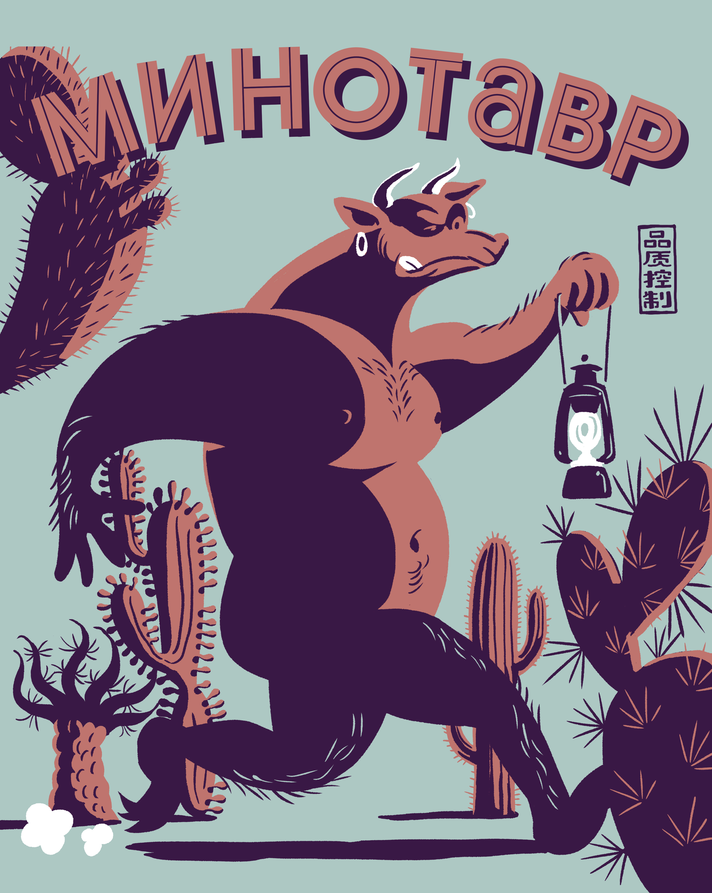
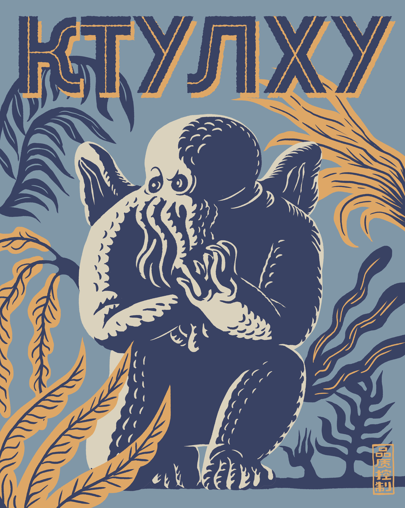
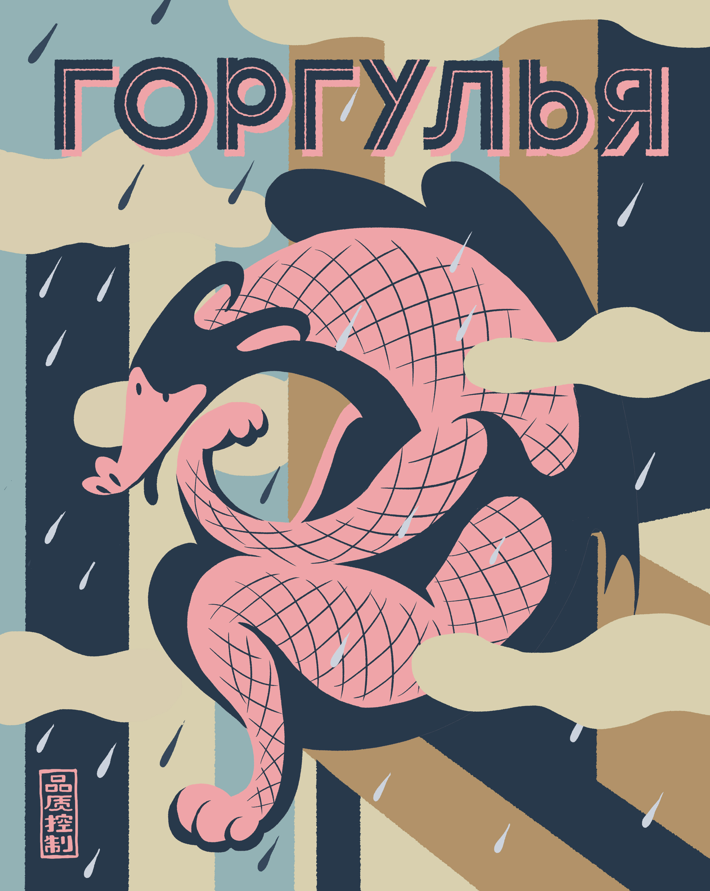

<!doctype html>
<html>
<head>
<meta charset="UTF-8">
<title>sanonatsu</title>
<link rel="stylesheet" href="https://sanonatsu.github.io/sanonatsu-sample.github.io/sanonatsu_style.css">
<link href="https://use.fontawesome.com/releases/v5.6.1/css/all.css" rel="stylesheet">
</head>

<body>
<header>

	

		
		<ul>
			<li>WORKS</li>
			<li>HIRE ME</li>
		</ul>
	

	

		<i class="fab fa-facebook-square"></i>
		<i class="fab fa-instagram"></i>
	

</header>

	

		
		
		
		
		
		
		
		
		
		
		
		
	

</body>
</html>
